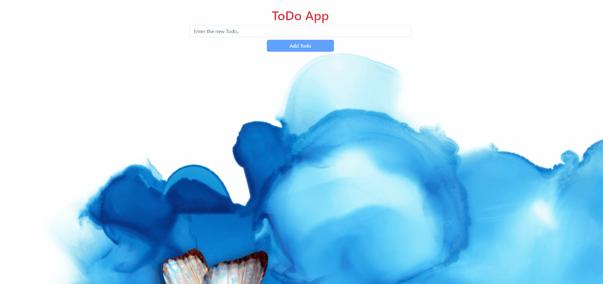

<h1>Soner Yılmaz</h1>
<h3>React-ToDo-App</h3>

<br>

## Project Skeleton

```
React-ToDo-App(folder)
|
|----readme.md         # Given to the students (Definition of the project)
SOLUTION
├── public
│     └── index.html
├── src
│    ├── components
│    │       ├── Header.jsx
│    │       │   
│    │       ├── TodoList.jsx 
│    │   
│    │ 
│    ├──────pages 
│    │         ├── Home.jsx
│    │
│    │
│    │ 
│    ├── App.js
│    ├── index.js
│    └── index.css
├── package.json
└── yarn.lock
```

## Objective

Build a Todo App using ReactJS.

### At the end of the project, following topics are to be covered;

- HTML

- CSS

- JS

- ReactJS

## ToDo App Projects Demo
[Todo App Live](https://react-to-do-app-snr.netlify.app/)


## ToDo App Projects




